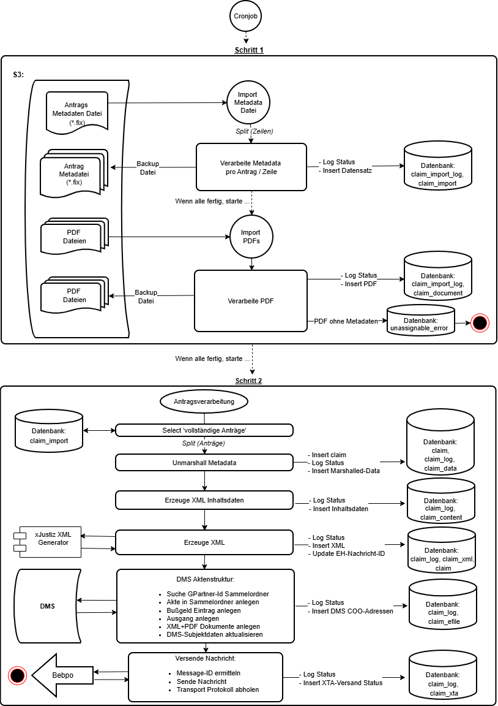

# Dokumentation
 
- Die Enterprise Application Integration Komponente (EAI) verarbeitet Anträge aus der Verwaltung, erstellt ein XML im [xJustiz Format](https://xjustiz.justiz.de/) Format und übermittelt die Fälle einzeln über das [Behördenpostfach](https://www.bamf.de/DE/Themen/Digitalisierung/beBPo/beBPo-node.html) an die Justizverwaltung. 
- Die Antragsfälle werden mit der Kombination _GeschäftspartnerId_, _Kassenzeichen_ und _Datum_ eindeutig identifiziert. 
- Die Antrags Metadaten werden in einer Datei im Format Satz-Fester-Länge zusammen mit den erstellten amtlichen Dokumenten im PDF Format der EAI in einem S3 Objektspeicher zur Verarbeitung Verfügung gestellt. 
- Die Antrags Metadaten und PDFs werden auf unterschiedlichen Wegen bereit gestellt und von der EAI aus einem jeweils eigenen S3-Bucket für die Antrags Metadaten und die PDFs gelesen.
- Die Verarbeitung erfolgt in _zwei Schritten_. Zur Synchronisation der Fallbearbeitung in Schritt 1 + 2 dient eine Datenbank.
- Die Verabeitung der EAI dokumentiert für jeden einzelnen Antragsfall verschiedene erreichte 'Zustände' ihrer Bearbeitung in eigenen Log-Tabellen. Sollte die Verarbeitung eines Falls auf einen unbekannten Fehler laufen, ist auch dieser zur Nachvollziehbarkeit dort dokumentiert.
- In _Schritt 1 werden die Antrags Metadaten eingelesen_. Alle eingelesenen Dateien werden zur weiteren EAI Verarbeitung in der Datenbank gespeichert und zur Dokumentation / Fehlerbhandlung und einen eigenen S3 'Backup' verschoben.
- In _Schritt 2 erfolgt nach dem vollständigen Eingang aller Antragsdaten_ (Metadaten + erforderliche PDFs) die eigentliche Verarbeitung.
- Für die Antrags Verarbeitung muss pro Antrag ein XML im [xJustiz Format](https://xjustiz.justiz.de/) erstellt werden. Dazu dient ein eigenes [xJustiz Projekt](https://github.com/it-at-m/xjustiz) das in der EAI als Maven Artefakt referenziert ist.
- Vor dem Versand an die Justiz über das [Behördenpostfach](https://www.bamf.de/DE/Themen/Digitalisierung/beBPo/beBPo-node.html) werden die versendeten Dateien pro Fall im Dokumentenmanagment System (DMS) abgelegt.
- Die EAI wird als CronJob ausgeführt.

Github-Repo: https://github.com/it-at-m/Erzwingungshaft

## Ablauf / Verarbeitungszustände



| Status                                             | Beschreibung                                                                                                              |
|----------------------------------------------------|---------------------------------------------------------------------------------------------------------------------------|
| IMPORT_DATA_FILE_CREATED                           | Raw data line read from original multi-line import file. Claim file (*.fix) generated in newly created 'claim-directory'. |
| IMPORT_DATA_FILE_IMPORT_FINISHED                   | Generate claim import files finished. Start import-pdfs process.                                                          |
| IMPORT_ANTRAG_IMPORT_DIRECTORY                     | Antrag PDF is imported and assigned to directory.                                                                         |
| IMPORT_BESCHEID_IMPORT_DIRECTORY                   | Bescheid PDF is imported and assigned to directory.                                                                       |
| IMPORT_VERWERFUNG_BESCHEID_IMPORT_DIRECTORY        | Verwerfungbescheid PDF is imported and assigned to directory.                                                             |
| IMPORT_KOSTEN_BESCHEID_IMPORT_DIRECTORY            | Kostenbescheid PDF is imported and assigned to directory.                                                                 |
| IMPORT_ANTRAG_IMPORT_DB                            | Antrag PDF is imported and assigned to database.                                                                          |
| IMPORT_BESCHEID_IMPORT_DB                          | Bescheid PDF is imported and assigned to database.                                                                        |
| IMPORT_KOSTEN_IMPORT_DB                            | Kostenbescheid PDF is imported and assigned to database.                                                                  |
| IMPORT_VERWERFUNG_IMPORT_DB                        | Verwerfungsbescheid PDF is imported and assigned to database.                                                             |
| CLAIM_RAW_DATA_READ                                | Raw data line read from generated claim file.                                                                             |
| CLAIM_RAW_DATA_UNMARSHALLED                        | Data unmarshalled from claim file line.n                                                                                  |
| CLAIM_CONTENT_DATA_CREATED                         | Content created for xJustiz message generation.                                                                           |
| CLAIM_XJUSTIZ_MESSAGE_CREATED                      | xJustiz xml message created.                                                                                              |
| CLAIM_EH_UUID_UPDATED                              | xJustiz message uuid updated in database.                                                                                 |
| CLAIM_EH_KASSENZEICHEN_GESCHAEFTSPARTNERID_UPDATED | 'Kassenzeichen' and 'GeschaeftsparterId' updated in database.                                                             |
| EFILE_GPID_COLLECTION_READ_FROM_DB                 | 'GeschaeftspartnerId' known in efile.                                                                                     |
| EFILE_GESCHAEFTSPARTNERID_COLLECTION_NOT_FOUND     | Collection file for 'GeschaeftspartnerId' not found in efile.                                                             |
| EFILE_GESCHAEFTSPARTNERID_COLLECTION_FOUND         | Collection file for 'GeschaeftspartnerId' found in efile.                                                                 |
| EFILE_GESCHAEFTSPARTNERID_COLLECTION_AMBIGUOUS     | More than one collection file for 'GeschaeftspartnerId' found in efile.                                                   |
| EFILE_FILE_ADDED_TO_COLLECTION                     | Case file added to efile collection.                                                                                      |
| EFILE_FILE_ALREADY_EXISTS_IN_COLLECTION            | Case file already exists in efile collection.                                                                             |
| EFILE_FINE_ADDED_TO_CASE_FILE                      | Fine file added to efile case file.                                                                                       |
| EFILE_OUTGOING_ADDED_TO_FINE                       | Outgoing file added to efile fine file.                                                                                   |
| EFILE_CONTENT_OBJECT_ANTRAG_ADDED_TO_OUTGOING      | Content object 'Antrag' added to efile outgoing.                                                                          |
| EFILE_CONTENT_OBJECT_URBESCHEID_ADDED_TO_OUTGOING  | Content object 'URBESCHEID' added to efile outgoing.                                                                      |
| EFILE_CONTENT_OBJECT_XML_ADDED_TO_OUTGOING         | Content object 'Verfahrensmitteilung.xml' added to efile outgoing.                                                        |
| EFILE_OBJECTADDRESSES_SAVED                        | Collection, case file, fine and documents efile objectaddresses saved in database.                                        |
| EFILE_SUBJECT_FILE_DATA_SAVED                      | GP-Name, GP-Firstname, GP-Birthdate updated in efile file.                                                                |
| EFILE_SUBJECT_OWI_DATA_SAVED                       | 'Ordnungswidrigkeitnummer (OWI)' updated in efile fine.                                                                   |
| EFILE_SUBJECT_DATA_SKIPPED                         | Subject data attributes (efile.case-file, efile.fine) not defined in properties.                                          |
| XTA_MESSAGE_ID                                     | XTA message id received.                                                                                                  |


## Technisches Setup

- Die Zugansgdaten zum S3 Objektspeicher und den Buckets müssen bekannt sein.
- Die Zugansgdaten zum DMS müssen bekannt sein.
- Die Zugansgdaten zum [Behördenpostfach](https://www.bamf.de/DE/Themen/Digitalisierung/beBPo/beBPo-node.html) müssen bekannt sein.
- Für die Initialisierung der [Behördenpostfach](https://www.bamf.de/DE/Themen/Digitalisierung/beBPo/beBPo-node.html) Schnittstelle kann ein Proxy konfiguriert werden. Ggf. müssen Non-Proxies definiert werden, damit die übrigen Schnittstellen wie gewünscht erreicht werden.
- Datenbank Änderungen werden mit flyway verwaltet (https://github.com/it-at-m/refarch / https://refarch.oss.muenchen.de/).
- Die Maven Plugins cxf-codegen-plugin und openapi-generator-maven-plugin müssen erfolgreich durchlaufen und ihr Maven _target_ Verzeichnis dem Classpath bekannt sein.
- Zur Ausführung der Tests mit Testcontainern ist eine laufende Docker / Podman Instanz erforderlich.


### xJustiz 

Die _xjustiz_ Eigenschaften fassen verschiedene Konfigurationen der XML Generierung startend von Datei Operationen bis zu Inhalten des _xJustiz XML_ zusammen. 

Der [xJustiz-Standard](https://xjustiz.justiz.de/) ist ein bundesweiter Standard für den elektronischen Datenaustausch.
Der xJustiz-Standard unterliegt einer [Versionierung](https://xjustiz.justiz.de/Dokumentation_Versionen/index.php).

````
xjustiz:
  version: # Must be configured
````

#### Dateien importieren, verarbeiten, ausgeben

_xjustiz.interface.file.line-break_ konfiguriert das betriebssystemabhängigen _Read-Line_ der _Antrags-Metadaten-Datei_.

````
xjustiz:
  interface:
    file:
      line-break: \n
````

##### S3 Schnittstellen Konfiguration

Dateien importieren und exportieren (Backup) die zur Generierung des xJustiz XML erforderlich sind.

_xjustiz.interface.file.common_ ist optional und wird nur in der application.yml Konfiguration intern referenziert.

````
xjustiz:
  credentials:
    s3:
      access-key: # Must be configured
      secret-key: # Must be configured
  interface:
    file:
      common: # Can be configured example : accessKey=${xjustiz.credentials.s3.access-key}&secretKey=${xjustiz.credentials.s3.secret-key}&region=${camel.component.aws2-s3.region}&overrideEndpoint=${camel.component.aws2-s3.override-endpoint}&uriEndpointOverride=${camel.component.aws2-s3.uri-endpoint-override}
      consume: # Must be configured example : aws2-s3://eh-import-antrag?${xjustiz.interface.file.common}
      file-output: # Must be configured example : aws2-s3://eh-backup?${xjustiz.interface.file.common}
    pdf:
      consume: # Must be configured exmample : aws2-s3://eh-import-pdf?${xjustiz.interface.file.common}
      file-output: # Must be configured example : aws2-s3://eh-backup?${xjustiz.interface.file.common}
````

#### XML Generator

Die Generierung des XML im [xJustiz](https://xjustiz.justiz.de/) Standard erfolgt in einem externen Modul das in einem eigenen [xJustiz Projekt](https://github.com/it-at-m/xjustiz) entwickelt und als Spring-Boot Starter in der pom.xml eingebunden ist.

````
...
    <!-- it@m -->
    <dependency>
        <groupId>de.muenchen.oss</groupId>
        <artifactId>xjustiz-starter</artifactId>
        <version>${xjustiz.converter}</version>
    </dependency>
...    
````

Das _xjustiz-starter_ Artefakt startet eine Apache Camel Route zur Generierung des XML mit den erforderlichen Namespaces die im vorliegend Projekt einfach referenziert wird.

````
xjustiz:
  interface:
    document:
      processor: direct:xjustiz-document-processor
````

Das Artefakt _xjustiz-starter_ beinhaltet alle Klassen zur jeweiligen [xJustiz-Standard](https://xjustiz.justiz.de/) Version. Die Klassen stehen im _xjustiz-starter_ in compilierter Form zur Verfügung.
Die Klassen jeder XSD stehen in einem eigenen Java Package zur Verfügung. Damit die Klassen einer XSD zur Laufzeit gefunden werden können muss die Ablage der XSDs und Klassenpackages konfiguriert sein.
Die Werte Konfigurationsparemeter sind im [xJustiz Projekt](https://github.com/it-at-m/xjustiz) festgelegt.

````
xjustiz:
  xsd:
    path: # Must be configured.  
    generated-package-base: # Must be configured
````

Für die im Erzwingungshaft Projekt erforderliche Kommunikation mit dem xJustiz-Standard muss das Dokument _NachrichtStrafOwiVerfahrensmitteilungExternAnJustiz0500010_ als XML erstellt werden.

Mit _xjustiz-starter_ Artefakt bietet die Möglichkeit eine mit allen Inhalten komplettierte Objektinstanz des _NachrichtStrafOwiVerfahrensmitteilungExternAnJustiz0500010_ Dokuments per marshalling (Serialisierung) in ein XML zu wandeln.
Darüberhinaus stellt das _xjustiz-starter_ Artefakt auch einen _Builder_ zur Erstellung der Objektinstanz _NachrichtStrafOwiVerfahrensmitteilungExternAnJustiz0500010_ Dokuments für das nachgelagerte marshalling zur Verfügung.
Der Builder erstellt die Objektinstanz und fügt an den erforderlichen Stellen die nötigen Inhalte ein. Die Inhalte können differenziert werden in _statische_ und _dynamische_ fallbezogene Inhalte.

Unter _xjustiz.xjustiz0500straf..._ können alle _statischen_ Inhalte für den LHM Anwendungsfall _NachrichtStrafOwiVerfahrensmitteilungExternAnJustiz0500010_ konfiguriert werden.
Die _dynamischen_ Inhalte werden im Schritt 2 'Erzeuge XML Inhaltsdaten' aus den eingelesenen Sätzen der 'Antrags Medadaten Datei' ergänzt. 

Der [xJustiz-Standard](https://xjustiz.justiz.de/) sieht an verschiedener Stelle die Verwendung von [xJustiz-Codelisten](https://xjustiz.justiz.de/Dokumentation_Versionen/index.php#XJustiz-Codelisten) vor.
Diese können unter _xjustiz.codelisten..._ definiert werden. Weitere Informationen dazu finden sich der Dokumentation des [xjustiz-Projekts](https://github.com/it-at-m/xjustiz).

Die Inhalte von _xjustiz.xjustiz0500straf..._ und _xjustiz.codelisten..._ dienen also der Konfiguration _NachrichtStrafOwiVerfahrensmitteilungExternAnJustiz0500010 Builders_ des [xjustiz-Projekts](https://github.com/it-at-m/xjustiz).
Wird der Builder nicht verwendet, können die Inhalte aus der application.yml des vorliegenden Projekts entfernt werden.

````
xjustiz:
  xjustiz0500straf:
    nachrichtenkopf:
      auswahl-absender-sonstige: # Must be configured
      auswahl-herstellerinformation-produkt: # Must be configured
      auswahl-herstellerinformation-produkt-name: # Must be configured
      auswahl-herstellerinformation-produkt-version: # Must be configured
    grunddaten:
      verfahrensdaten:
        beteiligung:
          organisation:
            bezeichnung-aktuell: # Must be configured
            bezeichnung-anschrift-strasse: # Must be configured
            bezeichnung-anschrift-hausnummer: # Must be configured
            bezeichnung-anschrift-plz: # Must be configured
            bezeichnung-anschrift-ort: # Must be configured
            bezeichnung-bankverbindung: # Must be configured
  codelisten:  # Example see https://github.com/it-at-m/xjustiz
    gds-rollenbezeichnung:
      current-version: # Must be configured
      kennung: # Must be configured
      codelist-versions:
        gds-rollenbezeichnung-3-5:
          betroffener: # Must be configured
          antragsteller: # Must be configured
          bussgeldempfaenger: # Must be configured
````

### Dokumenten Management System

Das Dokumenten Management System (DMS) ist über eine REST Schnittstellen EAI angebunden.
Die Openapi JSON Version der aktuell veröffentlichten REST EAI muss korrekt angegeben sein (_efile.connection.eakte-api-version_).

Unter _efile.case_file_ und _efile.fine_ sind die nötigen Angaben zum Auffinden und Einfügen der DMS Einträge zu konfigurieren.
Mit _...subject-data-values_ können die Inhalte ausgewählter Element geändert werden. 

````
efile:
  connection:
    host:  # Must be configured
    scheme: # Must be configured
    port: # Must be configured
    context-path: api/
    username: # Must be configured
    password: # Must be configured
    eakte-api-version: openapi/eakte-api-v1.2.4.json
  case-file:
    aktenplan-eintrag: # Must be configured
    x-anwendung: # Must be configured
    userlogin: # Must be configured
    joboe: # Must be configured
    jobposition: # Must be configured
    objaddress: # Must be configured
    subject-data-values:
      gp-name: # Can be configured
      gp-first-name: # Can be configured
      gp-birth-date: # Can be configured
  fine:
    shortname: # Must be configured
    filesubj: # Must be configured
    accdef: # Must be configured
    outgoing: # Must be configured
    doctemplate: # Must be configured
    subfiletype: # Must be configured
    incattachments: # Must be configured
#    subject-data-values:      # If commented create WARN otherwise INFO Message
#      owi-number: # Can be configured

````

### Behördenpostfach

Die Anbindung an das [Behördenpostfach](https://www.bamf.de/DE/Themen/Digitalisierung/beBPo/beBPo-node.html) erfordert die Konfiguration der XTA Schnittstelle.

Je nachdem wo die EAI betrieben wird ist die Konfiguration eines _Proxy_ erforderlich, damit sich die XTA Schnittstelle initialisieren kann ist möglicherweise eine Proxy Konfiguration notwendig.
Der Proxy wird als System Umgebungsvariable eingrichtet (http.proxyHost usw.). Er wird daher auch bei anderen Schnittstellen Initialisierungen (S3 etc.) berücksichtigt. In diesem Fall kann es nötig sein diese als _nonProxyHosts_ zu berücksichtigen.

````
proxy:
  http:
    host: # Can be configured
    port: # Can be configured
    non-proxy-hosts:
      - # Can be configured

bebpo:
  xta:
    management-port-uri: # Must be configured
    msg-boxport-uri: # Must be configured
    send-port-uri: # Must be configured
    tls:
      client-cert-keystore:
        url: # Must be configured
        store-password: # Must be configured
        type: # Must be configured
    party-identifier:
      destination: # Must be configured
      originator: # Must be configured
      type: # Must be configured
      name: # Must be configured
    message-type:
      list-uri: # Must be configured
      list-version: # Must be configured
      payload-schema: # Must be configured
      code: # Must be configured
````

### Beispielkonfiguration

````
batch:
  enabled: false

proxy:
  http:
    host: 1.1.1.1
    port: 80
    non-proxy-hosts:
      - 127.0.0.1

spring:
  datasource:
    url: jdbc:tc:postgresql:///testdb?TC_TMPFS=/testtmpfs:rw
    username: admin
    password: admin
  jpa:
    properties:
      hibernate:
        dialect: org.hibernate.dialect.PostgreSQLDialect
  flyway:
    schemas: eh

management:
  endpoints:
    access:
      default: none

logging:
  level:
    de.muenchen.eh: DEBUG
    org:
      springframework: INFO
      apache:
        cxf:
          service: DEBUG

camel:
  main:
    tracing: false
  component:
    aws2-s3:
      override-endpoint: true
      region: local
      uri-endpoint-override: http://127.0.0.1:9000

efile:
  connection:
    host: localhost
    scheme: http
    port: 8081
    context-path: api/
    username:
    password:
    eakte-api-version: openapi/eakte-api-v1.2.4.json
  case-file:
    aktenplan-eintrag: 1234/Testakte
    x-anwendung: EH
    userlogin: test
    joboe: COO.2150.9150.1.15756
    jobposition: DocumentManager
    objaddress: COO.2150.9169.1.1632
    subject-data-values:
      gp-name: BusinessDataGPSurname
      gp-first-name: BusinessDataGPFirstname
      gp-birth-date: BusinessDataGPBirthDate
  fine:
    shortname: Bussgeldverfahren
    filesubj: Bussgeldbescheid
    accdef: 'Zugriffsdefinition für Schriftgutobjekte (allgemein lesbar)'
    outgoing: Ausgang
    doctemplate: 'LHM Schreiben Extern'
    subfiletype: PDF-Dokument
    incattachments: EH-Dokumente
#    subject-data-values:
#      owi-number: 'Ordnungswidrigkeiten-Nummer'

# Custom properties
xjustiz:
  version: 3.5.1
  xsd:
    path: xsd/XJustiz-3.5.1-XSD/
    generated-package-base: de.muenchen.xjustiz.generated
  credentials:
    s3:
      access-key: minioadmin
      secret-key: minioadmin
  interface:
    document:
      processor: direct:xjustiz-document-processor
    jpa:
      import: jpa
    file:
      common: accessKey=${xjustiz.credentials.s3.access-key}&secretKey=${xjustiz.credentials.s3.secret-key}&region=${camel.component.aws2-s3.region}&overrideEndpoint=${camel.component.aws2-s3.override-endpoint}&uriEndpointOverride=${camel.component.aws2-s3.uri-endpoint-override}
      consume: aws2-s3://eh-import-antrag?${xjustiz.interface.file.common}
      file-output: aws2-s3://eh-backup?${xjustiz.interface.file.common}
    pdf:
      consume: aws2-s3://eh-import-pdf?${xjustiz.interface.file.common}
      file-output: aws2-s3://eh-backup?${xjustiz.interface.file.common}
    xta: bebpoService
  xjustiz0500straf:
    xsd:
      name: xjustiz_0500_straf_3_5.xsd
    nachrichtenkopf:
      auswahl-absender-sonstige: Stadt München
      auswahl-herstellerinformation-produkt: LHM-itM-KM15
      auswahl-herstellerinformation-produkt-name: KVUweb
      auswahl-herstellerinformation-produkt-version: 1.0
    grunddaten:
      verfahrensdaten:
        beteiligung:
          organisation:
            bezeichnung-aktuell: Landeshauptstadt München Stadtkämmerei
            bezeichnung-anschrift-strasse: Landsbergerstraße
            bezeichnung-anschrift-hausnummer: 36
            bezeichnung-anschrift-plz: 80339
            bezeichnung-anschrift-ort: München
            bezeichnung-bankverbindung: DE86 7015 0000 0000 2030 00
  codelisten:
    gds-rollenbezeichnung:
      current-version: 3.5
      kennung: urn:xoev-de:xjustiz:codeliste:gds.rollenbezeichnung
      codelist-versions:
        gds-rollenbezeichnung-3-5:
          betroffener: '040'
          antragsteller: '016'
          bussgeldempfaenger: '046'
    gds-gerichte:
      current-version: 3.6
      kennung: urn:xoev-de:xjustiz:codeliste:gds.gerichte
      codelist-versions:
        gds-gericht-3-6:
          amtsgericht-muenchen: D2601
    gds-ereignis:
      current-version: 1.11
      kennung: urn:xoev-de:xjustiz:codeliste:gds.ereignis
      codelist-versions:
        gds-ereignis-1-11:
          neueingang-e-haft: 117
        gds-ereignis-1-10:
          neueingang-e-haft: 117
    gds-sachgebiet:
      current-version: 2.3
      kennung: urn:xoev-de:xjustiz:codeliste:gds.sachgebiet
      codelist-versions:
        gds-sachgebiet-2-3:
          owi-sachen: '026'
    gds-anschriftstyp:
      current-version: 3.0
      kennung: urn:xoev-de:xjustiz:codeliste:gds.anschriftstyp
      codelist-versions:
        gds-anschriftstyp-3-0:
          tatortanschrift: '006'
          dienst-geschaeftsanschrift: '003'
    bjf-staat:
      current-version: 7.0
      kennung: urn:xoev-de:bund:bfj:codeliste:bfj.staat
      codelist-versions:
        bjf-staat-7-0:
          deutschland: '000'
    gds-geschlecht:
      current-version: 2.1
      kennung: urn:xoev-de:xjustiz:codeliste:gds.geschlecht
      codelist-versions:
        gds-geschlecht-2-1:
          unbekannt: 0
          maennlich: 1
          weiblich: 2
          divers: 3
          saechlich: 4
    gds-dokumentklasse:
      current-version: 1.4
      kennung: urn:xoev-de:xjustiz:codeliste:gds.dokumentklasse
      codelist-versions:
        gds-dokumentklasse-1-4:
          antrag-behoerde: '016'
          bescheid: '017'
          kostendokument: '017'
          verwerfung: '017'
    gds-bestandteiltyp:
      current-version: 2.4
      kennung: urn:xoev-de:xjustiz:codeliste:gds.bestandteiltyp
      codelist-versions:
        gds-bestandteiltyp-2-4:
          original: '001'
          repraesentant: '002'
    gds-aktentyp:
      current-version: 2.2
      kennung: urn:xoev-de:xjustiz:codeliste:gds.aktentyp
      codelist-versions:
        gds-aktentyp-2-2:
          bussgeldakte: '010'
    gds-aktenzeichenart:
      current-version: 2.0
      kennung: urn:xoev-de:xjustiz:codeliste:gds.aktenzeichenart
      codelist-versions:
        gds-aktenzeichenart-2-0:
          aktuell: '001'
    gds-registerzeichen:
      current-version: 3.4
      kennung: urn:xoev-de:xjustiz:codeliste:gds.registerzeichen
      codelist-versions:
        gds-registerzeichen-3-4:
          bussgeldverfahren: OWi

bebpo:
  xta:
    management-port-uri: https://my-xta-server.de/GovGateway211/management211
    msg-boxport-uri: https://my-xta-server.de/MB_XTA-WS/XTA210msgBoxPort.svc
    send-port-uri: https://my-xta-server.de/GovGateway211/send211
    tls:
      client-cert-keystore:
        url: classpath:test-dummy.p12
        store-password: changeit
        type: PKCS12

    party-identifier:
      destination: DE.ABC.9999.888
      originator: abc000-1111-2222-3333-44444444
      type: XTA_ID
      name: 'KVUE EHaft'
    message-type:
      list-uri: urn:de:bos_bremen:gov:gateway:messageTypes
      list-version: 1.0
      payload-schema: http://xoev.de/transport/xta/21
      code: XTA

````